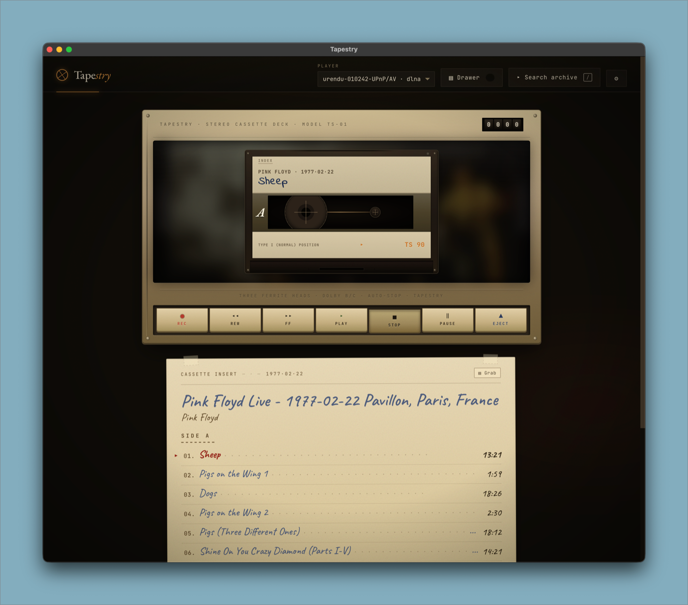
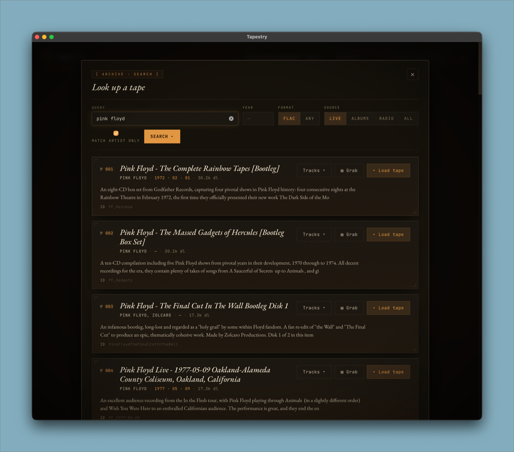
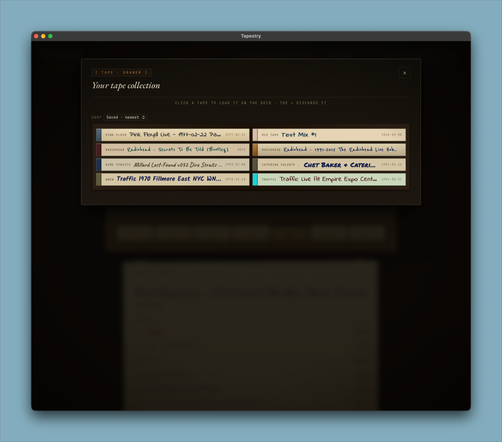
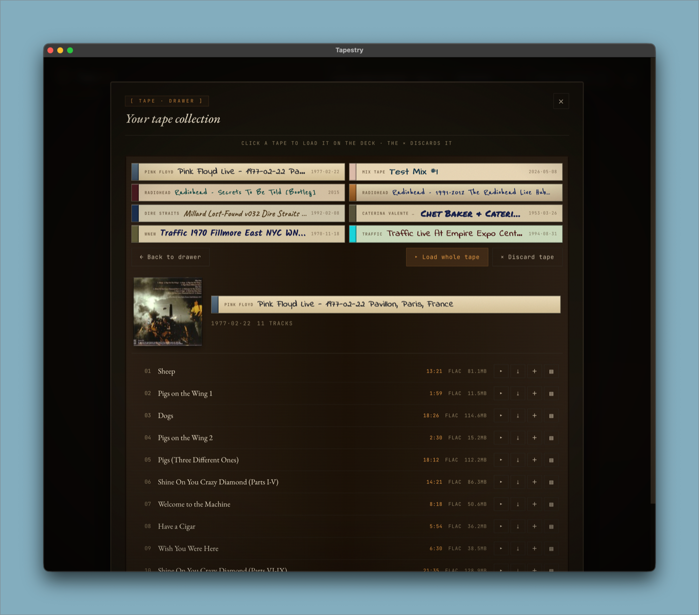

# Tapestry

A vintage cassette deck for [archive.org](https://archive.org) → your network audio. Browse the Live Music Archive, build mix tapes from arbitrary tracks, and stream the result to a Lyrion player, a DLNA renderer, an AirPlay-style endpoint, or your local Mac speakers — all from a Sony CHF90-styled UI that knows it's pretending to be hardware.

> **Tape · stry** — *woven from the live music archive.*



---

## Why

The archive.org plugin bundled with Lyrion is a favorites browser, not a search tool. You have to find shows in a separate browser window, add them to your archive.org favorites, and only *then* browse them inside Lyrion. Tapestry skips that loop and stops being Lyrion-only on the way:

1. Type a query (`traffic 1970 fillmore`).
2. Pick a result, hit **▸ Load tape** — or **▤ Grab** to save it for later, or click **▤** on individual tracks to build a mix tape.
3. Press **PLAY** on the cassette deck.
4. Audio streams directly from archive.org to whatever you've selected as the player — Lyrion, DLNA, your Mac, etc.

## What you get

### Search
- **archive.org search** with year, format (FLAC / any), and **source** filters: `LIVE` (curated etree archive **plus** title-heuristic concert/bootleg matches across the whole catalog), `ALBUMS`, `RADIO`, `ALL`. Noise collections (audiobooks, news scanners, religious radio) excluded by default.
- **Match artist only** checkbox — pins the query to the `creator` field so "Traffic" returns Traffic the band, not a traffic report.

### Playback
- **Multiple backends, one UI** — pick a player from a single dropdown:
  - **Lyrion** — JSON-RPC to your LMS instance (auto-discovered via mDNS, or set the URL in Settings).
  - **DLNA / UPnP** — auto-discovered AVTransport renderers (ultraRendu in MPD/DLNA mode, Sonos, smart TVs, AVRs).
  - **This Mac** — in-app playback via the system audio output.
  - *AirPlay coming.*
- **Hand-off** — switching the player dropdown ejects from the old deck and re-loads the same tape on the new one, paused. Press PLAY to resume on the new device.
- **Smart transport** — REW restarts the current track if you're more than 3 s in, otherwise jumps to the previous; FF jumps to the next track but suppresses Lyrion's "wrap to same track" loop on single-item queues. Double-click on REW or FF seeks ±30 s within the current track.
- **REC** — dubs the currently-playing track onto a mix tape under construction.

### Tape drawer
- **▤ Grab** — saves a tape to the drawer (from search results or via the Grab button on the loaded cassette's J-card insert).
- **Click a tape in the drawer** to "flip the case open" — full track list, with per-track ▸ play / ⤓ play next / ＋ add to queue / **▤ add to mix**, plus a single **▸ Load whole tape** action.
- **Sort** — saved newest/oldest, title A→Z, artist A→Z, year newest/oldest.
- **Color and cover art** — each tape gets a deterministic cassette palette (band, paper, ink, font); when there's archive.org artwork, the dominant color is extracted (canvas + HSL bucketing) and overrides the deterministic colors so the spine matches the album. The deck cassette displays the same palette as the drawer spine for the loaded tape.

### Mix tapes
- **▤ on any track** (search results or open drawer cases) adds it to a mix tape under construction.
- **Bottom-of-screen tray** persists across the deck, search, and drawer — keep adding tracks from any source.
- **90-minute cap**, with a progress bar that goes red when full. Overflow is rejected.
- **▸ Record** opens a save modal: name field, optional cover image upload (jpg/png/gif/webp, ≤ 6 MB) — uploaded covers are stored locally and their dominant color drives the mix tape's palette.

### Cassette UI
- **Sony CHF90-styled cassette deck** — three-section paper label (handwritten J-card with real track titles parsed from item descriptions), recessed bay with reels that grow/shrink with album playback, brushed-champagne chassis, piano-key transports, four-digit tape counter that ticks smoothly via predicted time between status polls.
- **Album artwork backdrop** — when a tape is loaded, archive.org's artwork (proxied to dodge CORS) is blurred + warm-tinted behind the cassette in the bay.
- **Audio feedback** — clunk on key press, cassette-load whoosh, eject spring — synthesized via Web Audio, no asset files.
- **Keyboard shortcuts** — `/` search · `t` drawer · `r` rec · `e` eject · `Esc` close

### Persistence
- Drawer + settings live at `~/Library/Application Support/Tapestry/` (or `./data/` in dev). Mix-tape covers under `mix-covers/`. Settings include the LMS URL and resolved-source hints (env / settings / default).

## Stack

- **Backend** — FastAPI + httpx (async). One Python module per backend (`players/lyrion.py`, `players/dlna.py`, `players/local.py`); the unified API is `/api/players/{backend}/{player_id}/{action}`.
- **Frontend** — vanilla ES module + hand-rolled CSS. No build step, no framework.
- **Discovery** — mDNS (`zeroconf`) for LMS, SSDP (`async-upnp-client`) for DLNA.
- **Storage** — JSON files for drawer + settings.
- **Desktop shell** — pywebview-based native window, packaged as `Tapestry.app` via PyInstaller.

## Quick start

**Requires Python 3.11 or newer.** macOS ships 3.9 by default — install via [Homebrew](https://brew.sh) (`brew install python@3.13`) if needed.

```bash
git clone https://github.com/Ethros19/tapestry.git
cd tapestry
python3.13 -m venv .venv && source .venv/bin/activate
pip install -r requirements.txt

# dev mode — auto-reloads on Python edits, hard-refresh for CSS/JS
uvicorn app.main:app --reload --port 8080
# → http://localhost:8080

# native window mode
python -m app.desktop
```

The app finds your LMS automatically the first time you open Settings (⚙) and click **↻ Find LMS**, or set `LYRION_URL` once and forget it.

## Configuration

| Env var | Default | Purpose |
|---|---|---|
| `LYRION_URL` | `http://localhost:9000/jsonrpc.js` | JSON-RPC endpoint of your LMS. Overridden by Settings panel. |
| `TAPESTRY_DATA_DIR` | `~/Library/Application Support/Tapestry/` (or `./data/` in dev) | Where the drawer, settings, and mix-tape covers live. |

The Settings panel (⚙ in the topbar) also exposes:
- **↻ Find LMS** — mDNS-discover Lyrion servers on the LAN.
- **↻ Rescan players** — force backends with cached discovery (DLNA) to redo their search.
- **↻ Refresh artwork colors** — re-extract dominant colors from each saved tape's archive.org artwork or uploaded cover.

## Building a shareable .app

The repo includes scripts to produce a fully self-contained macOS app and disk image:

```bash
pip install -r requirements-dev.txt        # picks up Pillow + PyInstaller

./scripts/build-icon.sh                    # → dist/icon.icns (only run once, or after editing the icon)
./scripts/build-app.sh                     # → dist/Tapestry.app
./scripts/build-dmg.sh                     # → dist/Tapestry.dmg

open dist/Tapestry.app
```

`scripts/build-icon.py` draws the cassette icon at 1024×1024 using Pillow primitives — edit the function and rerun if you want to riff on the design.

### Sharing the .dmg

The unsigned `.app` triggers macOS Gatekeeper. Recipients need to right-click the app → **Open** → confirm in the dialog (or: System Settings → Privacy & Security → **Open Anyway**) the first time. After that it's trusted forever.

For a clean handoff, sign + notarize the build:
1. Get an Apple Developer ID (`Developer ID Application` cert).
2. Uncomment the `codesign` / `xcrun notarytool` blocks in **both** `scripts/build-app.sh` and `scripts/build-dmg.sh`, fill in `DEVELOPER_ID` and a `notarytool` keychain profile name.
3. Re-run the build.

## Architecture

```
                              Tapestry
                              ┌─────────────────────┐
   archive.org ──── search ──→│ FastAPI on :8080    │ ──── unified API ────→ ┬─ Lyrion (JSON-RPC)
                              │ + static frontend   │                        ├─ DLNA  (UPnP/AVTransport)
                              └─────────────────────┘                        ├─ Local (HTML <audio>)
                                                                             └─ AirPlay (planned)
```

The audio bytes generally flow **archive.org → player** directly (LMS or a DLNA renderer fetches the URL it's told to play). Tapestry orchestrates control and metadata, not bytes.

## API

All `/api/players/{backend}/{player_id}/...` endpoints accept these `{action}`s: `status` (GET), `play`, `add`, `insert`, `play_show`, `load_show`, `start`, `pause`, `stop`, `next`, `prev`, `eject`, `seek_by`, `volume`. The frontend calls the unified path; the legacy `/api/lyrion/*` is kept for backwards compatibility.

Other endpoints:

- `GET  /api/players` — aggregated list of players from every backend, with per-backend `errors`.
- `POST /api/players/rescan` — force DLNA re-discovery.
- `GET  /api/lyrion/discover` — mDNS-find LMS instances.
- `GET  /api/search?q=&year=&fmt=&source=&creator_only=`
- `GET  /api/item/<identifier>`
- `GET  /api/artwork/<identifier>` — proxies archive.org artwork (CORS shim).
- `GET  /POST /api/drawer`, `DELETE /api/drawer/<identifier>`
- `POST /api/mix-cover` — upload a cover image (multipart).
- `GET  /POST /api/settings`

OpenAPI docs at `/docs` while the server is running.

## Run as a background service (macOS, headless mode)

A launchd plist at `~/Library/LaunchAgents/com.ethros.tapestry.plist` with `RunAtLoad=true` and `KeepAlive=true` works fine — point its `WorkingDirectory` at the cloned repo and its `ProgramArguments` at the venv's `uvicorn`. Useful if you'd rather keep Tapestry running and access it from any browser on your network.

## Screenshots

**Search.** `LIVE` filter is on by default — etree archive plus title-heuristic concert/bootleg matches across the whole catalog, with audiobook / radio-news collections explicitly excluded. The "Match artist only" toggle pins the query to the `creator` field for paranoid filtering.



**Drawer.** Each saved tape is a horizontal cassette spine — band color, paper, ink and font are all derived deterministically from the item's identifier (or extracted from the album artwork when available, so the spine matches the cover).



**Drawer · case open.** Click a spine and the case "flips open": album art, full track list, per-track ▸ play / ⤓ play next / ＋ add to queue / **▤ add to mix**, plus a single **▸ Load whole tape** action. Building a mix tape from your saved drawer is faster than searching twice.



## License

[MIT](LICENSE).

## Credits

- [archive.org Live Music Archive](https://archive.org/details/etree) — the corpus
- [Lyrion Music Server](https://lyrion.org) — the player network
- [`async-upnp-client`](https://github.com/StevenLooman/async_upnp_client) — DLNA control
- [`zeroconf`](https://github.com/python-zeroconf/python-zeroconf) — mDNS discovery
- The Sony CHF90 — the visual reference
- The bootleg-trader culture that built etree.org and the tape-tree distribution method this app's branding nods to
